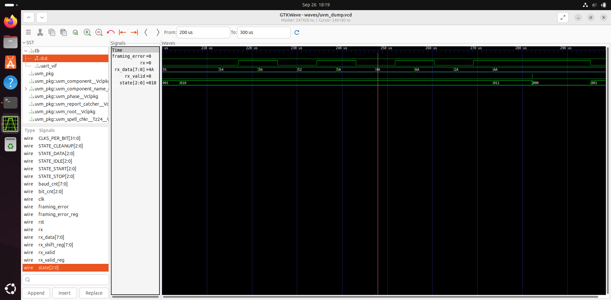

# 8-bit UART Receiver RTL Design & Functional Verification

A complete Verilog/SystemVerilog UART receiver project featuring FSM-based RTL design, conventional SystemVerilog verification, and a structured UVM-based verification environment with functional coverage, negative testing, and waveform analysis.

---

## Project Overview

This project implements and verifies an **8-bit UART receiver** using Verilog RTL.

The UART receiver supports:

- 8-bit data
- No parity
- 1 stop bit
- LSB-first transmission
- Parameterized baud-rate timing
- Start-bit validation
- Framing-error detection
- FSM-based protocol control

The verification environment was developed in two stages:

1. **Conventional SystemVerilog verification environment**
2. **UVM-based functional verification environment**

The UVM environment uses standard verification components including a sequence, sequencer, driver, monitor, agent, scoreboard, environment, functional coverage, and test.

Simulation and waveform analysis are performed using **Verilator** and **GTKWave**.

---

## UART Protocol

The receiver implements an **8N1 UART frame**:

```text
Idle    Start    Data[0] ... Data[7]    Stop
  1       0          LSB ... MSB          1
```

### UART Configuration

| Parameter | Value |
|---|---|
| Data bits | 8 |
| Parity | None |
| Stop bits | 1 |
| Data order | LSB-first |
| `CLKS_PER_BIT` | 217 |
| Clock period | 40 ns |
| Bit period | 8.68 µs |

The bit period is:

```text
217 × 40 ns = 8680 ns = 8.68 µs
```

---

# RTL Design

## UART Receiver FSM

The UART receiver uses an FSM to control the reception process.

```text
             RX = 0
               |
               v
          +---------+
          |  IDLE   |
          +---------+
               |
               v
          +---------+
          |  START  |
          +---------+
               |
        Valid start bit
               |
               v
          +---------+
          |  DATA   |
          +---------+
               |
        8 data bits
               |
               v
          +---------+
          |  STOP   |
          +---------+
             /   \
        RX=1     RX=0
          |        |
          v        v
       Valid    Framing
       frame     error
          |        |
          +---+----+
              |
              v
          +---------+
          | CLEANUP |
          +---------+
              |
              v
            IDLE
```

### FSM States

| State | Description |
|---|---|
| `STATE_IDLE` | Waits for the beginning of a UART frame |
| `STATE_START` | Validates the start bit |
| `STATE_DATA` | Samples and shifts the 8 data bits |
| `STATE_STOP` | Checks the stop bit |
| `STATE_CLEANUP` | Completes the received transaction |

---

## RTL Outputs

The design provides:

```text
rx_data
rx_valid
framing_error
```

### `rx_data`

Contains the received 8-bit UART data.

### `rx_valid`

Asserted when a complete UART frame with a valid stop bit has been received.

### `framing_error`

Asserted when the expected stop bit is not detected.

---

## Start-Bit Validation

The receiver does not immediately accept every falling edge as a valid UART start bit.

The start bit is validated by sampling the RX line around the expected middle of the start-bit period.

If the line has returned high before the expected sampling point, the receiver treats it as a **false start** and returns to the idle state.

---

## Framing-Error Detection

The receiver explicitly checks the stop bit.

For a valid UART frame:

```text
Stop bit = 1
```

If the stop bit is low:

```text
Stop bit = 0
```

the receiver asserts:

```text
framing_error = 1
rx_valid      = 0
```

This behavior is verified using a dedicated invalid-stop test.

---

# Verification Environment

The project contains two verification environments.

## 1. Conventional SystemVerilog Testbench

Located in:

```text
tb/
```

The conventional environment contains:

```text
uart_rx_tb.sv
uart_driver.sv
uart_monitor.sv
uart_scoreboard.sv
uart_coverage.sv
uart_assertions.sv
```

The testbench provides:

- UART stimulus generation
- DUT monitoring
- Self-checking scoreboard
- Functional coverage
- Assertions
- Normal and corner-case scenarios

---

# 2. UVM Verification Environment

Located in:

```text
uvm_tb/
```

The UVM environment follows a structured verification architecture.

```text
                    uart_test
                        |
                        v
                    uart_env
                        |
             +----------+----------+
             |                     |
             v                     v
         uart_agent           uart_scoreboard
             |
       +-----+-----+
       |     |     |
       v     v     v
     seqr  driver monitor
             |
             |
             v
           DUT
```

### UVM Components

| Component | Purpose |
|---|---|
| `uart_sequence_item.sv` | Defines UART transaction data |
| `uart_sequence.sv` | Generates directed and randomized transactions |
| `uart_sequencer.sv` | Supplies transactions to the driver |
| `uart_driver.sv` | Converts transactions into UART serial stimulus |
| `uart_monitor.sv` | Observes DUT outputs |
| `uart_agent.sv` | Encapsulates sequencer, driver and monitor |
| `uart_scoreboard.sv` | Compares expected and actual results |
| `uart_coverage.sv` | Collects functional coverage |
| `uart_env.sv` | Instantiates and connects verification components |
| `uart_test.sv` | Controls the UVM test execution |
| `uart_if.sv` | Provides the DUT/UVM virtual interface |
| `tb.sv` | Top-level simulation module and DUT instantiation |

---

# UVM Test Scenarios

The UVM sequence contains directed, randomized, negative, and back-to-back transactions.

### Normal Transactions

Directed values include:

```text
00
55
AA
FF
```

Additional randomized UART data values are also generated.

### Invalid Stop-Bit Test

A UART frame is generated with:

```text
Stop bit = 0
```

The expected behavior is:

```text
rx_valid      = 0
framing_error = 1
```

### False-Start Test

A short low pulse is generated that does not remain low for a valid start-bit period.

The expected behavior is:

```text
rx_valid      = 0
framing_error = 0
```

### Back-to-Back Transactions

The environment also verifies consecutive UART frames:

```text
3C
C3
96
69
```

This checks that the receiver correctly returns to the idle state and accepts the following frame.

---

# Scoreboard

The UVM scoreboard uses analysis FIFOs to compare expected and actual transactions.

```text
Driver
  |
  | expected transaction
  v
Expected FIFO
  |
  v
Scoreboard
  ^
  |
Actual FIFO
  ^
  |
Monitor
```

The scoreboard checks:

### Normal Frame

```text
Received data == Expected data
rx_valid      == 1
framing_error == 0
```

### Invalid Stop Frame

```text
framing_error == 1
rx_valid      == 0
```

### False Start

The scoreboard verifies that no unexpected UART response is generated.

---

# Functional Coverage

Functional coverage is collected by the UVM coverage component.

The verification environment achieved:

```text
UART Functional Coverage = 100.00%
```

The coverage environment exercises different received data patterns and UART frame conditions.

---

# Verification Results

The final UVM regression contains:

```text
Valid transactions : 18
Total transactions : 20
```

The two additional transactions are the negative tests:

```text
1 × Invalid stop-bit frame
1 × False-start condition
```

### Final Scoreboard Result

```text
PASS = 20
FAIL = 0
CHECKS = 20
```

### UVM Report

```text
UVM_ERROR : 0
UVM_FATAL : 0
```

### Functional Coverage

```text
100.00%
```

---

# Waveform Analysis

The UVM testbench generates a VCD waveform using:

```systemverilog
$dumpfile("waves/uvm_dump.vcd");
$dumpvars(0, tb);
```

The waveform can be inspected using **GTKWave**.

The waveform analysis was used to verify:

- UART RX serial activity
- Start-bit detection
- Data-bit reception
- Bit counter progression
- Baud counter progression
- FSM state transitions
- Shift-register contents
- `rx_valid` assertion
- Framing-error assertion
- Invalid stop-bit behavior

## Normal UART Reception

A normal frame can be observed progressing through:

```text
IDLE
  ↓
START
  ↓
DATA
  ↓
STOP
  ↓
CLEANUP
  ↓
IDLE
```

The received data is transferred into `rx_data`, followed by a `rx_valid` pulse after successful stop-bit validation.

## Invalid Stop-Bit Reception

For the invalid-stop test:

```text
DATA = 0xA5
STOP = 0
```

the waveform shows:

```text
framing_error = 1
rx_valid      = 0
```

This confirms the RTL framing-error detection logic.

## GTKWave Waveform

The following waveform shows UART RX activity, received data, `rx_valid`, `framing_error`, and FSM state transitions during simulation.



The waveform demonstrates multiple UART transactions and provides visual confirmation of the receiver's RTL behavior during simulation.

---

# Simulation Tools

The project was developed and simulated using:

| Tool | Purpose |
|---|---|
| Verilator | RTL compilation and simulation |
| UVM | Functional verification framework |
| GTKWave | Waveform analysis |
| SystemVerilog | Verification/testbench development |
| Git/GitHub | Version control and project management |

---

# Conventional Testbench Simulation

From the project root:

```bash
cd ~/vlsi_project/uart_receiver
```

Compile the conventional testbench:

```bash
rm -rf sim/obj_dir

verilator --binary --timing --trace \
    -Wno-ZERODLY \
    --top-module uart_rx_tb \
    --Mdir sim/obj_dir \
    rtl/uart_rx.v \
    tb/uart_driver.sv \
    tb/uart_monitor.sv \
    tb/uart_scoreboard.sv \
    tb/uart_coverage.sv \
    tb/uart_assertions.sv \
    tb/uart_rx_tb.sv
```

Run:

```bash
./sim/obj_dir/Vuart_rx_tb
```

---

# UVM Simulation

The project uses the Verilator-compatible UVM implementation located through:

```bash
$UVM_HOME
```

Compile the UVM environment:

```bash
cd ~/vlsi_project/uart_receiver

rm -rf sim/uvm_obj_dir

verilator --binary --timing \
    -j 4 \
    --coverage \
    -Wno-fatal \
    -Wno-TIMESCALEMOD \
    -Wno-ZERODLY \
    +incdir+$UVM_HOME/src \
    +incdir+uvm_tb \
    +define+UVM_NO_DPI \
    $UVM_HOME/src/uvm_pkg.sv \
    rtl/uart_rx.v \
    uvm_tb/tb.sv \
    --top-module tb \
    --Mdir sim/uvm_obj_dir
```

Run the UVM simulation:

```bash
./sim/uvm_obj_dir/Vtb 2>&1 | tee sim/uvm_run.log
```

A successful run reports:

```text
PASS = 20
FAIL = 0
CHECKS = 20
```

and:

```text
UART Functional Coverage = 100.00%
```

---

# Waveform Viewing

After running the UVM simulation, the waveform is generated at:

```text
waves/uvm_dump.vcd
```

Open it using:

```bash
gtkwave waves/uvm_dump.vcd
```

The generated waveform files are intentionally excluded from Git tracking because they are simulation artifacts.

---

# Project Structure

```text
uart_receiver/
│
├── README.md
├── .gitignore
│
├── rtl/
│   └── uart_rx.v
│
├── tb/
│   ├── uart_rx_tb.sv
│   ├── uart_driver.sv
│   ├── uart_monitor.sv
│   ├── uart_scoreboard.sv
│   ├── uart_coverage.sv
│   └── uart_assertions.sv
│
├── uvm_tb/
│   ├── tb.sv
│   ├── uart_if.sv
│   ├── uart_sequence_item.sv
│   ├── uart_sequence.sv
│   ├── uart_sequencer.sv
│   ├── uart_driver.sv
│   ├── uart_monitor.sv
│   ├── uart_agent.sv
│   ├── uart_scoreboard.sv
│   ├── uart_coverage.sv
│   ├── uart_env.sv
│   └── uart_test.sv
│
├── docs/
│   └── uvm_waveform.png
│
├── sim/
│   ├── obj_dir/
│   └── uvm_obj_dir/
│
└── waves/
    ├── dump.vcd
    └── uvm_dump.vcd
```

> `sim/` and `waves/` contain generated simulation artifacts and are excluded from Git tracking.

---

# Key Verification Features

- FSM-based UART receiver RTL
- Parameterized baud-rate timing
- 8-bit 8N1 UART protocol
- LSB-first data reception
- Start-bit validation
- False-start rejection
- Explicit framing-error detection
- Conventional SystemVerilog testbench
- UVM-based verification environment
- Directed and randomized stimulus
- Negative testing
- Self-checking scoreboard
- Analysis FIFOs
- Functional coverage
- Back-to-back frame verification
- Assertion-based checks in the conventional environment
- VCD waveform generation
- GTKWave waveform analysis
- 100% functional coverage
- 0 UVM errors
- 0 UVM fatal errors

---

# Future Scope

Possible extensions to the project include:

- UART transmitter RTL
- Full UART TX/RX communication system
- Additional baud-rate configurations
- Additional protocol corner-case testing
- SystemVerilog assertions within the UVM environment
- More extensive constrained-random verification
- Coverage-driven test generation
- RTL linting
- RTL synthesis
- Static timing analysis
- ASIC RTL-to-GDSII flow
- FPGA implementation and hardware validation

---

# Author

**Kaivalya Nibandhe**

B.E. Electronics & Communication Engineering
